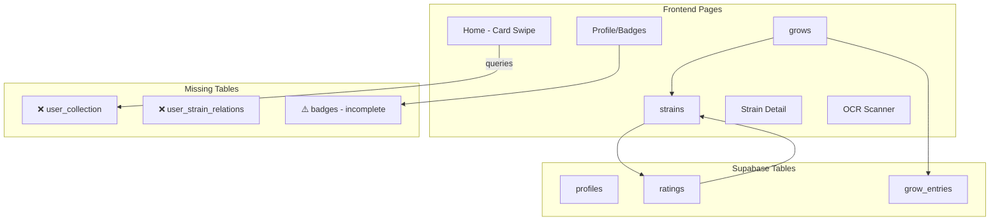

# GreenLog App Analysis

## Overview
**Project:** GreenLog - Medical Cannabis Collection & Grow Tracker  
**Tech Stack:** Next.js 16, React 19, TypeScript, Supabase, Tailwind CSS, Tesseract.js OCR

---

## ✅ What's Working Well

### 1. Solid Technical Foundation
- Modern stack with latest versions (Next.js 16, React 19)
- TypeScript for type safety
- Supabase for auth + database with proper RLS policies
- Clean component architecture with shadcn/ui

### 2. Beautiful UI/UX
- **Dark forest green theme** (#355E3B) with cyan (#00F5FF) and neon green (#2FF801) accents
- Mobile-first design with bottom navigation
- **Swipeable card interface** on home screen
- Smooth animations with CSS/Framer Motion patterns
- Responsive touch gestures

### 3. Strain Database
- 200+ medical cannabis strains with high-quality images
- Rich data: THC/CBD ranges, terpenes, effects, flavors
- Slug-based routing for SEO
- Brand/manufacturer information
- Medical indications tracked

### 4. Core Features Implemented
| Feature | Status |
|---------|--------|
| User authentication | ✅ |
| Strain browsing/search | ✅ |
| Card-based collection view | ✅ |
| Ratings system (1-5 stars) | ✅ |
| Grow journal/tracker | ✅ |
| Grow entries with environment data | ✅ |
| Profile page | ✅ |
| OCR label scanner | ✅ |
| Demo mode | ✅ |

### 5. Gamification
- XP and level system
- Badge achievements
- Progress tracking
- Visual feedback on collection progress

### 6. Security
- Supabase Row Level Security (RLS) properly configured
- Users can only modify their own data
- Public/private grow visibility options

---

## ❌ Issues & Missing Features

### Critical (Broken/Missing)

#### 1. **User Collection Table Mismatch**
```sql
-- App code references: user_collection
-- Actual schema has: ratings (used as collection)
```
- Home page tries to query `user_collection` table which doesn't exist
- Falls back to demo data or fails silently

#### 2. **Terpene Data Structure Inconsistent**
```sql
-- Current: TEXT[] (simple array)
terpenes TEXT[] DEFAULT '{}'

-- Should be: JSONB (structured objects with percentages)
-- {name: "Myrcene", percent: 0.5}
```

#### 3. **Favorites/Wishlist Not Implemented**
- Heart button exists on strain cards
- No backend logic to save favorites
- No `user_strain_relations` table

#### 4. **Public/Private Profile Mode Incomplete**
- TypeScript has `profile_visibility` field
- Supabase schema lacks `profile_visibility` column
- No API filtering for public vs private profiles

#### 5. **Badge System UI-Only**
- Badges display in profile
- No trigger logic in backend
- Missing badge definitions table updates

### Medium Priority

#### 6. **THC/CBD Field Naming Inconsistency**
```typescript
// Types expect:
avg_thc?: number;
avg_cbd?: number;

// Schema has:
thc_min DECIMAL(4,1);
thc_max DECIMAL(4,1);
cbd_min DECIMAL(4,1);
cbd_max DECIMAL(4,1);
```

#### 7. **Missing Strain Types**
- Enum only: `('indica', 'sativa', 'hybrid')`
- Missing: `ruderalis`

### Minor

#### 8. **Code Duplication**
- Similar API calls repeated across pages
- Missing shared hooks for data fetching

#### 9. **No Image Upload**
- User images for ratings are referenced but upload not implemented

---

## 📊 Architecture Diagram



---

## 🎯 Recommended Priority

### Phase 1: Fix Broken Features
1. Create `user_collection` table or fix Home page to use `ratings`
2. Fix terpene data structure in schema and migrations
3. Add `profile_visibility` to profiles table

### Phase 2: Complete MVP
4. Implement favorites/wishlist with `user_strain_relations` table
5. Add badge trigger functions
6. Fix THC/CBD field consistency

### Phase 3: Polish
7. Add image upload functionality
8. Create shared data hooks
9. Performance optimization

---

## Questions for Planning

1. Should `user_collection` be a separate table or continue using `ratings`?
2. Is the current rating system (1-5 stars) sufficient or need detailed reviews?
3. Which missing feature matters most to you?
