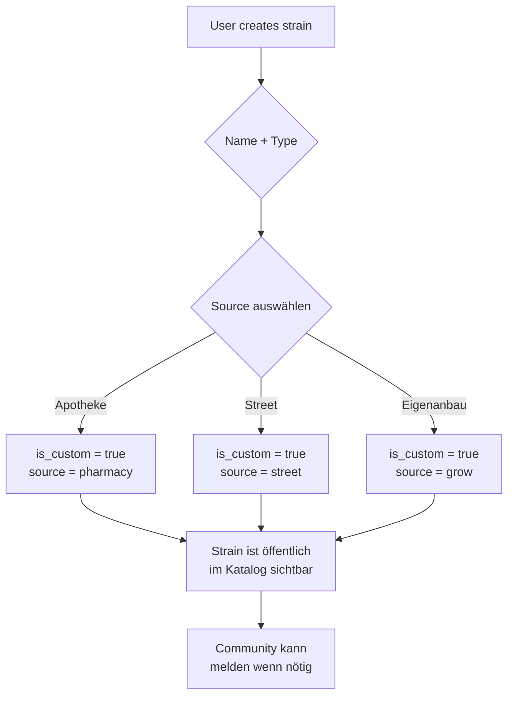

# Custom Strains Feature - Design Document
**Created:** 2026-03-23  
**Status:** Brainstorming

## Problem Statement
Users want to log cannabis strains that aren't available from pharmacies (e.g., from other sources). The current system only supports pre-defined strains from the seed database.

## Options Analysis

### Option A: "My Strains" (Private Personal List)
- ✅ Simple to implement
- ✅ Privacy-preserving
- ❌ No social sharing
- ❌ Can't be discovered by others

### Option B: Community Strains (Fully Public)
- ✅ Social discovery
- ❌ Requires moderation
- ❌ May expose sensitive user data
- ❌ Complex governance needed

### Option C: Hybrid - Private + Optional Publish (Recommended)
- ✅ Privacy by default
- ✅ Social sharing optional
- ✅ User control
- ✅ Can gamify with badges
- Migration path to Option B if community grows

### Option D: External Import via QR/Scanner
- ✅ Handles "unknown" strains from scanner
- ❌ Quality/consistency issues
- ❌ No verification

---

## Recommended Approach: Option C

### Core Concept
Users can create **personal strains** that are private by default. They can optionally publish strains to make them available to the community.

### Database Changes

```sql
-- Add to strains table
ALTER TABLE strains ADD COLUMN IF NOT EXISTS is_custom BOOLEAN DEFAULT false;
ALTER TABLE strains ADD COLUMN IF NOT EXISTS is_published BOOLEAN DEFAULT false;
ALTER TABLE strains ADD COLUMN IF NOT EXISTS source TEXT; -- 'pharmacy', 'street', 'grow', 'unknown'
```

### Feature Flow



### UI Components Needed

1. **Strain Creation Modal**
   - Name (required)
   - Type: Indica/Sativa/Hybrid (required)
   - Source: Apotheke / Street / Eigenanbau (required)
   - THC/CBD estimates (optional, user input)
   - Effects/Flavors (optional, user-defined)
   - Created by badge (shows username)

2. **My Strains Section** (Profile)
   - List of user's custom strains
   - Edit/Delete options
   - Filter by source
   - Stats: "Du hast X eigene Strains erstellt"

3. **Strain Selector Enhancement**
   - Filter: "Alle" / "Apotheke" / "Street" / "Eigenanbau" / "Meine"
   - Search includes custom strains
   - Custom strains show creator badge

4. **Report System**
   - "Melden" button on custom strains
   - Report reasons: Spam, Inappropriate, Duplicate
   - Admin dashboard for reports

### Privacy Considerations

- Custom strains are PUBLIC by default (community visible)
- Source is visible to all (Apotheke/Street/Grow)
- Creator username is shown on strain page
- Report system for inappropriate content
- User cannot hide custom strains once created

---

## Todo List

- [ ] **DB Migration:** Add is_custom, is_published, source fields to strains table
- [ ] **UI - Create Strain Modal:** Form with name, type, source, optional details
- [ ] **UI - My Strains Section:** Display user's custom strains in profile
- [ ] **UI - Strain Selector Update:** Tabs for All/My, search includes custom
- [ ] **API - Create Custom Strain:** POST endpoint with privacy defaults
- [ ] **API - Update/Publish:** Allow user to publish custom strains
- [ ] **Badge System:** Add "Strain Curator" badge for creating 5+ strains
- [ ] **Documentation:** Update user docs

---

## User Decisions (2026-03-23)

1. ✅ **Custom Strains im Hauptkatalog durchsuchbar** - wichtig
2. ❓ **Visuelle Kennzeichnung** - noch unsicher, braucht Diskussion
3. ✅ **Melde-System** - wichtig für Community
4. ✅ **Source-Tracking** - Apotheke/Street/Eigenanbau, wichtig für Nutzerbindung

---

## Recommended Approach: Option C (Hybrid)

### Core Concept
Users can create **personal strains** that are searchable in the main catalog. They can optionally mark the source. Privacy is maintained but source is visible to community.

### Database Changes

```sql
-- Add to strains table
ALTER TABLE strains ADD COLUMN IF NOT EXISTS is_custom BOOLEAN DEFAULT false;
ALTER TABLE strains ADD COLUMN IF NOT EXISTS source TEXT; -- 'pharmacy', 'street', 'grow'
ALTER TABLE strains ADD COLUMN IF NOT EXISTS created_by UUID REFERENCES profiles(id);
```
