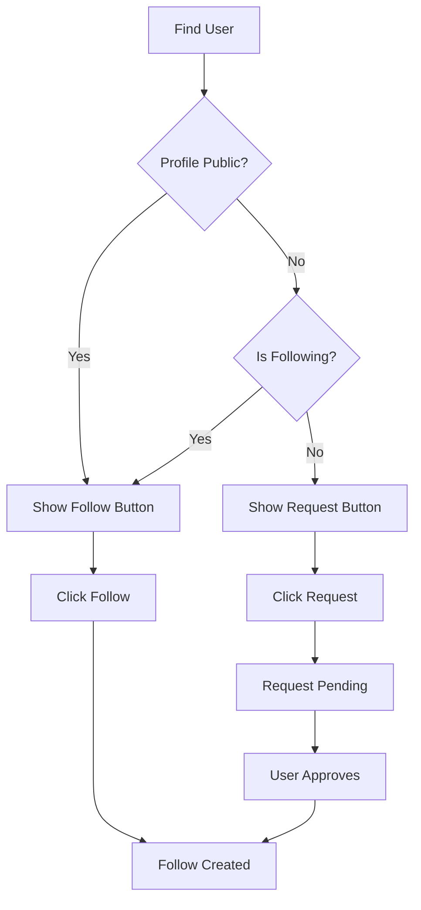
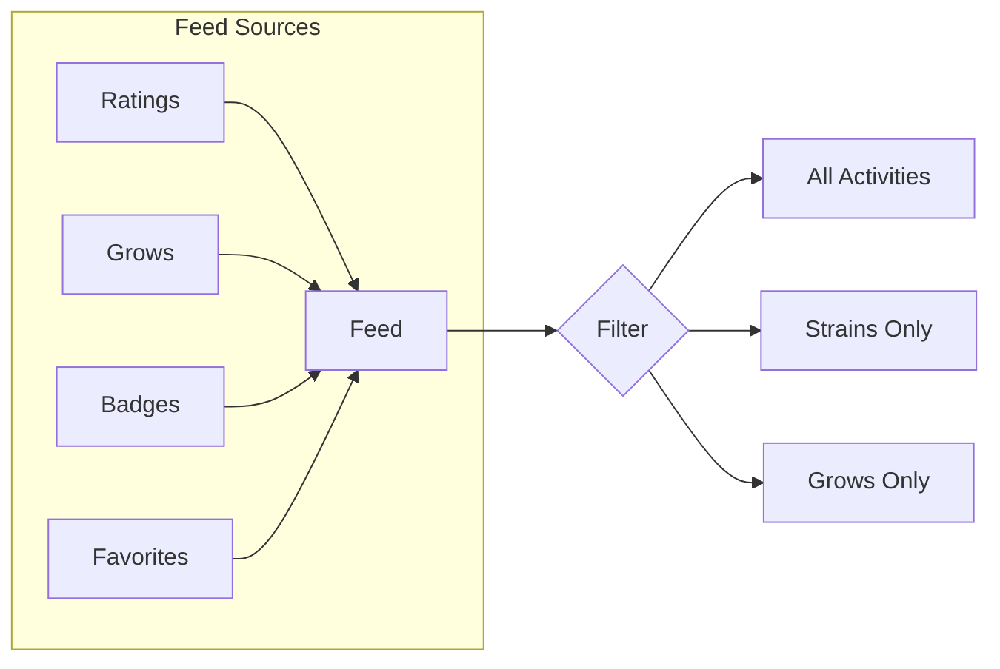

# GreenLog Social Features - Technical Design

## Context

GreenLog is a cannabis tracking app where users can rate strains, add favorites, log grows, and earn badges. The current database schema in `supabase-schema.sql` includes:
- `profiles` - user profiles with username, display_name, avatar_url, bio, profile_visibility (public/private)
- `strains` - cannabis varieties with details
- `ratings` - user strain ratings (1-5 stars with reviews)
- `grows` - grow journals (indoor/outdoor, medium, lighting, yield)
- `grows_entries` - daily grow log entries
- `user_strain_relations` - favorites and wishlist
- `user_badges` - earned badges
- `user_collection` - personal strain collection with notes

The app uses Next.js with Supabase, has a dark theme, and is mobile-first.

## Requirements Summary

1. **User Discovery** - Search users, browse public profiles, suggested users to follow
2. **Follow System** - Follow/unfollow, follower/following counts, private profile handling
3. **Social Feed** - Activity from followed users (ratings, grows, badges)
4. **Profile Enhancement** - Edit profile (avatar, bio, location), view others' public profiles
5. **Privacy** - Private profiles visibility rules, per-post visibility

---

## 1. Database Schema Changes

### 1.1 New Tables

```sql
-- User follows
CREATE TABLE follows (
  id UUID PRIMARY KEY DEFAULT gen_random_uuid(),
  follower_id UUID REFERENCES profiles(id) ON DELETE CASCADE NOT NULL,
  following_id UUID REFERENCES profiles(id) ON DELETE CASCADE NOT NULL,
  created_at TIMESTAMPTZ DEFAULT now(),
  UNIQUE(follower_id, following_id)
);

-- Activity feed (denormalized for performance)
CREATE TABLE user_activities (
  id UUID PRIMARY KEY DEFAULT gen_random_uuid(),
  user_id UUID REFERENCES profiles(id) ON DELETE CASCADE NOT NULL,
  activity_type TEXT NOT NULL CHECK (activity_type IN ('rating', 'grow_started', 'grow_completed', 'badge_earned', 'favorite_added')),
  target_id UUID NOT NULL, -- strain_id or grow_id or badge_id
  target_name TEXT NOT NULL,
  target_image_url TEXT,
  metadata JSONB DEFAULT '{}',
  created_at TIMESTAMPTZ DEFAULT now()
);

-- Follow requests (for private profiles - optional enhancement)
CREATE TABLE follow_requests (
  id UUID PRIMARY KEY DEFAULT gen_random_uuid(),
  requester_id UUID REFERENCES profiles(id) ON DELETE CASCADE NOT NULL,
  target_id UUID REFERENCES profiles(id) ON DELETE CASCADE NOT NULL,
  status TEXT DEFAULT 'pending' CHECK (status IN ('pending', 'approved', 'rejected')),
  created_at TIMESTAMPTZ DEFAULT now(),
  UNIQUE(requester_id, target_id)
);
```

### 1.2 Extended Profiles Table (add location)

```sql
ALTER TABLE profiles ADD COLUMN location TEXT;
ALTER TABLE profiles ADD COLUMN website TEXT;
ALTER TABLE profiles ADD COLUMN social_links JSONB DEFAULT '{}';
```

### 1.3 Extended Grows Table (visibility per grow)

The `grows` table already has `is_public` boolean. No schema change needed.

### 1.4 Extended Ratings Table (visibility)

```sql
ALTER TABLE ratings ADD COLUMN is_public BOOLEAN DEFAULT true;
```

### 1.5 RLS Policies for New Tables

```sql
-- Follows RLS
ALTER TABLE follows ENABLE ROW LEVEL SECURITY;

-- Can view followers/following if profile is public OR user is follower
CREATE POLICY "Can view followers/following"
  ON follows FOR SELECT USING (
    EXISTS (
      SELECT 1 FROM profiles p
      WHERE p.id = following_id AND p.profile_visibility = 'public'
    )
    OR EXISTS (
      SELECT 1 FROM follows f
      WHERE f.follower_id = auth.uid() AND f.following_id = following_id
    )
    OR auth.uid() = following_id
  );

-- Can follow if not blocked and target is public OR authenticated
CREATE POLICY "Can create follow"
  ON follows FOR INSERT WITH CHECK (
    auth.uid() = follower_id
    AND EXISTS (
      SELECT 1 FROM profiles p WHERE p.id = following_id
    )
  );

-- Can unfollow own follows
CREATE POLICY "Can delete own follow"
  ON follows FOR DELETE USING (auth.uid() = follower_id);

-- User Activities RLS
ALTER TABLE user_activities ENABLE ROW LEVEL SECURITY;

CREATE POLICY "Can view own activities"
  ON user_activities FOR SELECT USING (auth.uid() = user_id);

CREATE POLICY "Followers can view public activities"
  ON user_activities FOR SELECT USING (
    is_public = true
    OR auth.uid() = user_id
    OR EXISTS (
      SELECT 1 FROM follows WHERE follower_id = auth.uid() AND following_id = user_id
    )
  );

CREATE POLICY "Create activity for own actions"
  ON user_activities FOR INSERT WITH CHECK (auth.uid() = user_id);
```

### 1.6 Indexes

```sql
CREATE INDEX idx_follows_follower ON follows(follower_id);
CREATE INDEX idx_follows_following ON follows(following_id);
CREATE INDEX idx_user_activities_user ON user_activities(user_id);
CREATE INDEX idx_user_activities_type ON user_activities(activity_type);
CREATE INDEX idx_user_activities_created ON user_activities(created_at DESC);
```

---

## 2. API Endpoints

### 2.1 Profile Endpoints

| Method | Endpoint | Description |
|--------|----------|-------------|
| GET | `/api/profile/[username]` | Get public profile by username |
| GET | `/api/profile/[username]/stats` | Get profile statistics |
| PUT | `/api/profile/me` | Update own profile |
| POST | `/api/profile/me/avatar` | Upload avatar image |
| GET | `/api/profile/[username]/followers` | Get followers list |
| GET | `/api/profile/[username]/following` | Get following list |

### 2.2 Follow Endpoints

| Method | Endpoint | Description |
|--------|----------|-------------|
| POST | `/api/follow/[userId]` | Follow a user |
| DELETE | `/api/follow/[userId]` | Unfollow a user |
| GET | `/api/follow/status/[userId]` | Get follow status |

### 2.3 Discovery Endpoints

| Method | Endpoint | Description |
|--------|----------|-------------|
| GET | `/api/users/search?q=` | Search users by username |
| GET | `/api/users/suggested` | Get suggested users to follow |
| GET | `/api/users/browse` | Browse public profiles (paginated) |

### 2.4 Activity Feed Endpoints

| Method | Endpoint | Description |
|--------|----------|-------------|
| GET | `/api/feed` | Get social feed (followed users' activities) |
| GET | `/api/feed/discover` | Discover public activities |

---

## 3. Component Architecture

### 3.1 New Components

```
src/components/
├── social/
│   ├── UserSearch.tsx          # User search with autocomplete
│   ├── UserCard.tsx            # Compact user card for lists
│   ├── UserAvatar.tsx          # Avatar with online status
│   ├── FollowButton.tsx        # Follow/unfollow button
│   ├── FollowerList.tsx        # Followers/Following modal
│   ├── SuggestedUsers.tsx      # Suggested users carousel
│   ├── ActivityFeed.tsx        # Social activity feed
│   ├── ActivityItem.tsx        # Single activity item
│   ├── ProfilePreview.tsx      # Public profile preview card
│   └── PrivacySelector.tsx     # Visibility toggle component
├── profile/
│   ├── EditProfileForm.tsx     # Profile edit form
│   ├── PublicProfileView.tsx   # Public profile page
│   ├── ProfileHeader.tsx       # Profile header with avatar/stats
│   └── ProfileTabs.tsx         # Tab navigation for profile sections
```

### 3.2 Page Routes

```
src/app/
├── user/
│   └── [username]/
│       └── page.tsx            # Public user profile page
├── discover/
│   └── page.tsx                # User discovery/search page
├── feed/
│   └── page.tsx                # Social activity feed page
└── settings/
    └── page.tsx                # Profile & privacy settings
```

---

## 4. UI/UX Flow

### 4.1 User Discovery Flow

```
┌─────────────────────────────────────────────────────────────┐
│  Discover Page                                              │
│  ┌───────────┐ ┌───────────┐ ┌───────────┐                  │
│  │ 🔍 Search │ │ 🌐 Browse │ │ ⭐ Suggested│                 │
│  └───────────┘ └───────────┘ └───────────┘                  │
│                                                              │
│  Search: Real-time search as user types                      │
│  Browse: Grid of public profiles                             │
│  Suggested: Users with similar ratings/grows                 │
└─────────────────────────────────────────────────────────────┘
```

### 4.2 Follow System Flow



### 4.3 Activity Feed Flow



### 4.4 Privacy Model

```
┌─────────────────────────────────────────────────────────────┐
│  Privacy Levels                                             │
│                                                              │
│  Profile Visibility (profile_visibility)                     │
│  ├── Public: Anyone can see profile & stats                  │
│  └── Private: Only approved followers can see                │
│                                                              │
│  Per-Content Visibility (is_public)                          │
│  ├── Public ratings/grows visible in feed & search            │
│  └── Followers-only content hidden from non-followers        │
└─────────────────────────────────────────────────────────────┘
```

---

## 5. Suggested Users Algorithm

Users are suggested based on:

1. **Similar Strain Ratings**: Users who rated the same strains with similar ratings
2. **Similar Grow Types**: Users with grows in the same medium/grow type
3. **Same Location**: Users in the same location (if disclosed)
4. **Active Users**: Users active in the last 30 days
5. **Not Already Following**: Exclude users already followed

```sql
-- Simplified suggested users query
SELECT p.*, COUNT(DISTINCT r.strain_id) as common_strains
FROM profiles p
JOIN ratings r ON r.user_id = p.id
WHERE p.profile_visibility = 'public'
  AND p.id != :current_user_id
  AND p.id NOT IN (SELECT following_id FROM follows WHERE follower_id = :current_user_id)
  AND r.strain_id IN (
    SELECT strain_id FROM ratings WHERE user_id = :current_user_id
  )
GROUP BY p.id
ORDER BY common_strains DESC, p.created_at DESC
LIMIT 10;
```

---

## 6. Real-time Updates (Optional Enhancement)

Using Supabase Realtime for:

1. **New Follower Notifications**: When someone follows you
2. **Activity Feed Updates**: New activities from followed users
3. **Follow Request Updates**: Request approved/rejected

```typescript
// Realtime subscription example
supabase
  .channel('activities')
  .on('postgres_changes', { 
    event: 'INSERT', 
    schema: 'public', 
    table: 'user_activities',
    filter: `user_id=in.(${followedUserIds})`
  }, (payload) => {
    // Add to feed
  })
  .subscribe();
```

---

## 7. Avatar Storage

```sql
-- Storage bucket for avatars
INSERT INTO storage.buckets (id, name, public) VALUES ('avatars', 'avatars', true);

CREATE POLICY "Anyone can view avatars" ON storage.objects
  FOR SELECT USING (bucket_id = 'avatars');

CREATE POLICY "Users can upload own avatar" ON storage.objects
  FOR INSERT WITH CHECK (
    bucket_id = 'avatars' 
    AND auth.uid()::text = (storage.foldername(name))[1]
  );

CREATE POLICY "Users can update own avatar" ON storage.objects
  FOR UPDATE USING (
    bucket_id = 'avatars' 
    AND auth.uid()::text = (storage.foldername(name))[1]
  );
```

---

## 8. Implementation Todo List

### Phase 1: Database & Backend
- [ ] Create database migration for new tables (follows, user_activities, follow_requests)
- [ ] Add new columns to profiles, ratings tables
- [ ] Set up RLS policies for new tables
- [ ] Create storage bucket for avatars
- [ ] Implement Supabase edge functions or API routes for follow/unfollow
- [ ] Implement activity feed aggregation triggers

### Phase 2: API Routes
- [ ] Create `/api/profile/[username]` GET endpoint
- [ ] Create `/api/profile/me` PUT endpoint  
- [ ] Create `/api/follow/[userId]` POST/DELETE endpoints
- [ ] Create `/api/users/search` endpoint
- [ ] Create `/api/users/suggested` endpoint
- [ ] Create `/api/feed` endpoint

### Phase 3: Core Components
- [ ] Build `UserCard` component
- [ ] Build `FollowButton` component
- [ ] Build `ActivityItem` component
- [ ] Build `ActivityFeed` component
- [ ] Build `SuggestedUsers` component

### Phase 4: Pages
- [ ] Create `/user/[username]` public profile page
- [ ] Create `/discover` page with search and browse
- [ ] Create `/feed` social activity feed page
- [ ] Update profile settings page with privacy controls

### Phase 5: Enhancements
- [ ] Implement avatar upload with cropping
- [ ] Add real-time notifications
- [ ] Implement follow requests for private profiles
- [ ] Add user blocking capability

---

## 9. Type Definitions

```typescript
// New types to add to src/lib/types.ts

export interface Follow {
  id: string;
  follower_id: string;
  following_id: string;
  created_at: string;
}

export interface UserActivity {
  id: string;
  user_id: string;
  activity_type: 'rating' | 'grow_started' | 'grow_completed' | 'badge_earned' | 'favorite_added';
  target_id: string;
  target_name: string;
  target_image_url?: string;
  metadata: Record<string, unknown>;
  created_at: string;
  // Joined data
  user?: ProfileRow;
}

export interface FollowRequest {
  id: string;
  requester_id: string;
  target_id: string;
  status: 'pending' | 'approved' | 'rejected';
  created_at: string;
}

export interface ProfileWithStats extends ProfileRow {
  stats: ProfileStats;
  followers_count: number;
  following_count: number;
  is_following?: boolean;
  is_following_me?: boolean;
}

export interface SocialFeedItem {
  activity: UserActivity;
  user: ProfileRow;
}
```

---

## 10. RLS Policy Summary

| Table | Select | Insert | Update | Delete |
|-------|--------|--------|--------|--------|
| profiles | Public profiles always visible; Private only visible to owner & followers | Owner only | Owner only | Owner only |
| follows | Visible if profile is public or is follower | Auth user as follower | - | Auth user as follower |
| user_activities | Public activities, own activities, or follower activities | Own user only | Owner only | Owner only |
| ratings | Everyone (existing) | Auth user (existing) | Owner (existing) | Owner (existing) |
| grows | Public or owner (existing) | Auth user (existing) | Owner (existing) | Owner (existing) |

---

## 11. Migration File Structure

```
supabase/migrations/
├── ...existing migrations...
├── 20260324000000_social_features.sql    # Main social schema
└── 20260325000000_social_functions.sql    # Helper functions & triggers
```

---

## Key Design Decisions

1. **No Follow Request Approval by Default**: Private profiles simply hide content; all users can follow public profiles. Follow requests can be added as enhancement.

2. **Denormalized Activity Feed**: `user_activities` table stores aggregated activities for query performance rather than computing from multiple tables.

3. **Per-Item Visibility**: Ratings and grows have individual `is_public` flags for granular privacy control.

4. **Suggested Users Algorithm**: Based on common strain ratings first, then grow type similarity.
